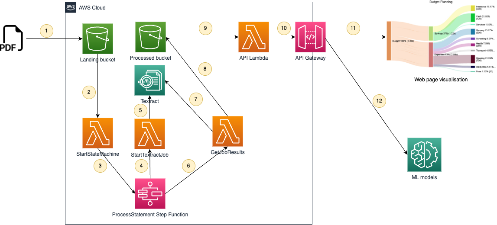

# textract-statement-processor

A sample pipeline that takes as input bank statements, extracts transaction information from
tables within the statements using Textract, stores, and classifies each transaction.

1.	PDF bank statements that have been scanned, or downloaded from an online banking application, are uploaded to the Landing bucket in S3
2.	The landing of the file in the S3 bucket triggers a Lambda function that starts the step function
3.	The Lambda function starts the step function execution 
4.	The first step in the step function calls a Lambda to start a new Textract document analysis job
5.	A new document analysis job is invoked with the uploaded PDF
6.	The step function periodically calls a Lambda to get the job results
7.	The Lambda checks with Textract, using the job identifier, whether the analysis job is complete
8.	When the analysis job is complete the Lambda takes the output of the job, extracts the tabular data, and processes the transaction records into a JSON file which it then saves in the Processed bucket in S3. 
9.	An API Lambda queries the JSON files stored in the S3 bucket in response to a request from the API gateway. An additional classification step at this point classifies each transaction into a type and sub-type based on user configurable classification rules.
10.	The API Gateway serves a RESTful API that a we frontend consumes to visualise transaction data
11.	Finally, the visualisation output of multiple years worth of classified transaction data is visualised within a Sankey diagram as shown below, allowing users to see at a glance income vs expenditure.
12.	ML models can be trained and run aginst historical transaction data
